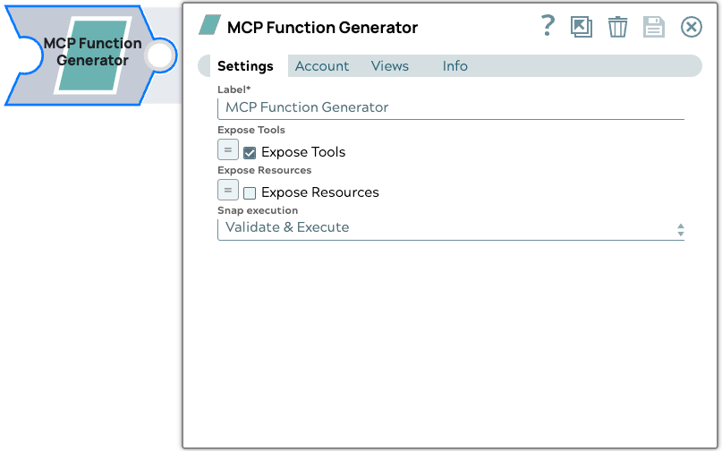

# MCP Function Generator

The MCP Function Generator Snap is a Snap to convert the tools available from an MCP server to a list of function definitions, with the additional ability to add "list resource" and "read resource" to the function definitions list.

{ align=left }

## Prerequisites

* A valid <a href="https://snaplogic.github.io/agentcreator-docs/snaps/mcp-sse-account/ ">MCP SSE Account</a> with required fields provided.

## Snap views
<table>
    <tr>
        <th>View</th>
        <th>Description</th>
        <th>Examples of upstream and downstream snaps</th>
    </tr>
    <tr>
        <td>Input</td>
        <td>The Snap supports a maximum of one document input view.</td>
        <td><ul><li><a href="https://docs-snaplogic.atlassian.net/wiki/spaces/SD/pages/1438286/Mapper">Mapper</a></li></ul></td>
    </tr>
    <tr>
        <td>Output</td>
        <td>The output contains a list (array) of tools or functions. Each item describes one function that can be used.

The output schema includes a set of MCP functions, each with metadata (the MCP operation to perform) and a structured definition of what input parameters they expect.</td>
        <td><ul><li><a href="https://docs.snaplogic.com/snaps/snaps-machine-learning/sp-openai-llm/snap-openai-tool-calling.html">OpenAI Tool Calling</a></li><li><a href="https://docs.snaplogic.com/snaps/snaps-machine-learning/sp-azure-openai-llm/snap-azure-openai-tool-calling.html">Azure OpenAI Tool Calling</a></li><li><a href="https://docs.snaplogic.com/snaps/snaps-machine-learning/sp-google-genai-llm/snap-gg-apc.html">Google Gemini API Tool Calling</a></li><li><a href="https://docs.snaplogic.com/snaps/snaps-machine-learning/sp-amazon-bedrock-llm/snap-ab-capi-tool-calling.html">Amazon Bedrock Converse API Tool Calling</a></li></ul></td>
    </tr>
    <tr>
        <td>Error</td>
        <td colspan="2">Error handling is a generic way to handle errors without losing data or failing the Snap execution. You can handle the errors that the Snap might encounter when running the pipeline by choosing one of the following options from the When errors occur list under the Views tab. The available options are:<ul><li>Stop Pipeline Execution Stops the current pipeline execution when an error occurs.</li><li>Discard Error Data and Continue Ignores the error, discards that record, and continues with the remaining records.</li><li>Route Error Data to Error View Routes the error data to an error view without stopping the Snap execution.</li></ul>Learn more about <a href="https://docs-snaplogic.atlassian.net/wiki/spaces/SD/pages/81526859">Error handling in Pipelines</a>.</td>
    </tr>
</table>

## Snap settings

!!! example "Legend:"

    * Expression icon({: style="height:16px"}): Allows using JavaScript syntax to access SnapLogic Expressions to set field values dynamicall (if enabled). If disabled, you can provide a static value. [Learn more](https://docs-snaplogic.atlassian.net/wiki/spaces/SD/pages/1438042/Understanding+Expressions+in+SnapLogic).
    * SnapGPT ({: style="height:16px"}): Generates SnapLogic Expressions based on natural language using SnapGPT. [Learn more](https://d14w8g1erguuat.cloudfront.net/rvw-jb-stage-202506-draft1/snapgpt/snapgpt-generate-expressions-mapper-snap.html).
    * Suggestion icon ({: style="height:16px"}): Populates a list of values dynamically based on your Snap configuration. You can select only one attribute at a time using the icon. Type into the field if it supports a comma-separated list of values.
    * Upload ({: style="height:16px"}): Uploads files. [Learn more](https://docs-snaplogic.atlassian.net/wiki/spaces/SD/pages/1439404).

| Field / Field set | Type | Description |
| ----------------- | ---- | ----------- |
| Label | String | Required. Specify a unique name for the Snap. Modify this to be more appropriate, esepcially if more than one of the same Snaps is in the pipeline. Default value: MCP Function Generator Example: Firecrawl tools |
| Expose Tools | Boolean | Select to include tools available from an MCP server to be converted into a list function definitions. Default status: Selected |
| Expose Resources | Boolean | Select to include two predefined tools: "read_resource" and "list_resources" into the list of function definitions, to enable the LLM to list available resources and read the resources. Default status: Deselected |