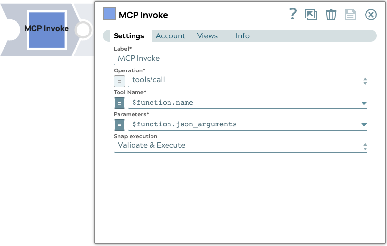

# MCP Invoke

The Agent Visualizer Snap is a Utility Snap for SnapLogic AI Agents.
It provides a comprehensive dual-view interface combining an interactive diagram and a detailed step-by-step log.
This dual visualization approach enables users to trace and analyze agent behavior precisely, offering enhanced transparency into complex AI agent operations and making it easier to understand how agents process and respond to user requests.

{ align=left }

## Prerequisites

* Existing Agentic Pipeline which has the full message log for the Agent

## Snap views
<table>
    <tr>
        <th>View</th>
        <th>Description</th>
        <th>Examples of upstream and downstream snaps</th>
    </tr>
    <tr>
        <td>Input</td>
        <td>This Snap has exactly one document input view. The Snap requires an input document to have an Agent message list as part of the input document schema for it to be visualized by the Agent Visualizer UI.</td>
        <td><a href="https://docs-snaplogic.atlassian.net/wiki/x/LICfzg">PipeLoop</a></td>
    </tr>
    <tr>
        <td>Output</td>
        <td>This Snap supports exactly two document output views. <ul><li>The First view is a passthrough of the input document for further processing downstream</li><li>The second output view is the actual agent visualizer log that is being visualized</li></ul></td>
        <td><a href="https://docs-snaplogic.atlassian.net/wiki/x/UfIV">JSON Formatter</a></td>
    </tr>
    <tr>
        <td>Error</td>
        <td colspan="2">Error handling is a generic way to handle errors without losing data or failing the Snap execution. You can handle the errors that the Snap might encounter when running the pipeline by choosing on eof the following options from the When errors occur list under the Views tab. The available options are:<ul><li>Stop Pipeline Execution Stops the current pipeline execution when an error occurs.</li><li>Discard Error Data and Continue Ignores the error, discards that record, and continues with the remaining records.</li><li>Route Error Data to Error View Routes the error data to an error view without stopping the Snap execution.</li></ul>Learn more about <a href="https://docs-snaplogic.atlassian.net/wiki/spaces/SD/pages/81526859">Error handling in Pipelines</a>.</td>
    </tr>
</table>

## Snap settings

!!! example "Legend:"

    * Expression icon({: style="height:16px"}): Allows using JavaScript syntax to access SnapLogic Expressions to set field values dynamicall (if enabled). If disabled, you can provide a static value. [Learn more](https://docs-snaplogic.atlassian.net/wiki/spaces/SD/pages/1438042/Understanding+Expressions+in+SnapLogic).
    * SnapGPT ({: style="height:16px"}): Generates SnapLogic Expressions based on natural language using SnapGPT. [Learn more](https://d14w8g1erguuat.cloudfront.net/rvw-jb-stage-202506-draft1/snapgpt/snapgpt-generate-expressions-mapper-snap.html).
    * Suggestion icon ({: style="height:16px"}): Populates a list of values dynamically based on your Snap configuration. You can select only one attribute at a time using the icon. Type into the field if it supports a comma-separated list of values.
    * Upload ({: style="height:16px"}): Uploads files. [Learn more](https://docs-snaplogic.atlassian.net/wiki/spaces/SD/pages/1439404).

| Field / Field set | Type | Description |
| ----------------- | ---- | ----------- |
| Label | String | Required. Specify a unique name for the Snap. Modify this to be more appropriate, esepcially if more than one of the same Snaps is in the pipeline. Default value: Agent Visualizer Example: Jira Agent Visualization |
| Log content | String/Expression | Required. Specify the log message data from the upstream document Default value: `$messages` |
| Visualize | Button | Click to launch the Agent Visualizer UI. |