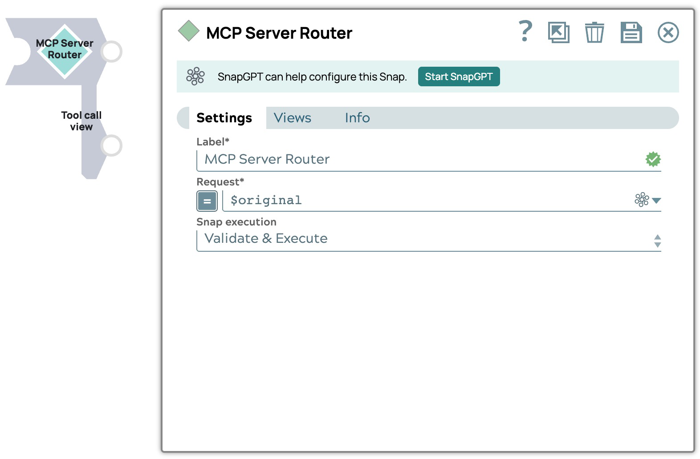

# MCP Server Router

The MCP Server Router Snap routes input documents based on the request method (`sl_method`). It also enriches tool call requests with necessary metadata before sending them downstream.

{ align=left }

## Snap views
<table>
    <tr>
        <th>View</th>
        <th>Description</th>
        <th>Examples of upstream and downstream Snaps</th>
    </tr>
    <tr>
        <td>Input</td>
        <td>This Snap supports exactly one document input view.</td>
        <td><ul>
            <li><a href="https://docs.snaplogic.com/snaps/snaps-machine-learning/sp-llm-utilities/snap-multi-pipeline-func-gen.html">Multi Pipeline Function Generator</a></li>
            <li><a href="https://docs.snaplogic.com/snaps/snaps-machine-learning/sp-llm-utilities/snap-openapi-func-gen.html">OpenAPI Function Generator</a></li>
            <li><a href="https://docs.snaplogic.com/snaps/snaps-machine-learning/sp-llm-utilities/snap-apim-to-functions.html">APIM Function Generator</a></li>
            <li><a href="https://docs.snaplogic.com/snaps/snaps-machine-learning/sp-llm-utilities/snap-func-gen.html">Function Generator</a></li>
        </ul></td>
    </tr>
    <tr>
        <td>Output</td>
        <td>This Snap supports exactly two document output views. 
        <ul>
            <li>The first output view outputs the input document when the request method is <code>tools/list</code>.</li>
            <li>The second output view outputs the request object when the request method is <code>tools/call</code>. If a tools list is provided in the input document, the Snap adds the corresponding tool metadata to the request object.</li>
        </ul></td>
        <td><ul>
            <li><a href="https://docs-snaplogic.atlassian.net/wiki/spaces/SD/pages/1438286/Mapper">Mapper</a></li>
            <li><a href="https://docs-snaplogic.atlassian.net/wiki/spaces/SD/pages/1438684/Pipeline+Execute">Pipeline Execute</a></li>
        </ul></td>
    </tr>
    <tr>
        <td>Error</td>
        <td colspan="2">Error handling is a generic way to handle errors without losing data or failing the Snap execution. You can handle the errors that the Snap might encounter when running the pipeline by choosing on eof the following options from the When errors occur list under the Views tab. The available options are:<ul><li>Stop Pipeline Execution Stops the current pipeline execution when an error occurs.</li><li>Discard Error Data and Continue Ignores the error, discards that record, and continues with the remaining records.</li><li>Route Error Data to Error View Routes the error data to an error view without stopping the Snap execution.</li></ul>Learn more about <a href="https://docs-snaplogic.atlassian.net/wiki/spaces/SD/pages/81526859">Error handling in Pipelines</a>.</td>
    </tr>
</table>

## Snap settings

!!! example "Legend:"

    * Expression icon({: style="height:16px"}): Allows using JavaScript syntax to access SnapLogic Expressions to set field values dynamicall (if enabled). If disabled, you can provide a static value. [Learn more](https://docs-snaplogic.atlassian.net/wiki/spaces/SD/pages/1438042/Understanding+Expressions+in+SnapLogic).
    * SnapGPT ({: style="height:16px"}): Generates SnapLogic Expressions based on natural language using SnapGPT. [Learn more](https://d14w8g1erguuat.cloudfront.net/rvw-jb-stage-202506-draft1/snapgpt/snapgpt-generate-expressions-mapper-snap.html).
    * Suggestion icon ({: style="height:16px"}): Populates a list of values dynamically based on your Snap configuration. You can select only one attribute at a time using the icon. Type into the field if it supports a comma-separated list of values.
    * Upload ({: style="height:16px"}): Uploads files. [Learn more](https://docs-snaplogic.atlassian.net/wiki/spaces/SD/pages/1439404).

| Field / Field set | Type | Description |
| ----------------- | ---- | ----------- |
| Label | String | Required. Specify a unique name for the Snap. Modify this to be more appropriate, esepcially if more than one of the same Snaps is in the pipeline. Default value: MCP Server Router Example: Firecrawl MCP Server Router |
| Request | String/Expression | The request object generated from the MCP Server Adapter to the MCP Server Pipeline. It must include the `sl_method` field, which defines the request method. Supported request methods are `tools/list` and `tools/call`. Default value:  `$` Example: `$original` |