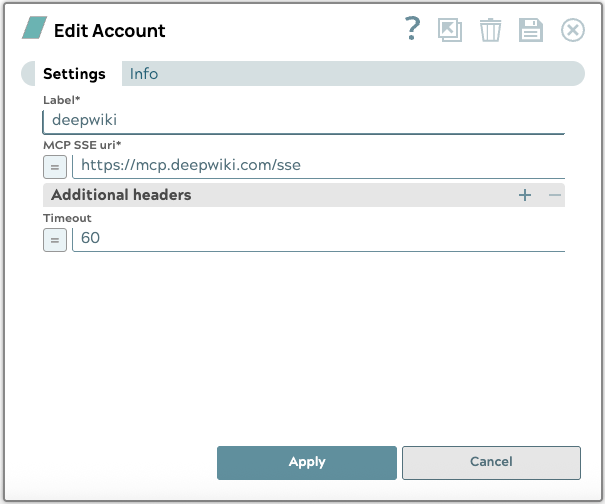

# MCP SSE Account

Use this account type to connect the MCP Client Snaps to a remote MCP SSE Server. 

{ align=middle }

## Prerequisites

* A valid MCP SSE URI and required header fields if necessary for an MCP Server

## Account settings

!!! example "Legend:"

    * Expression icon({: style="height:16px"}): Allows using JavaScript syntax to access SnapLogic Expressions to set field values dynamicall (if enabled). If disabled, you can provide a static value. [Learn more](https://docs-snaplogic.atlassian.net/wiki/spaces/SD/pages/1438042/Understanding+Expressions+in+SnapLogic).
    * SnapGPT ({: style="height:16px"}): Generates SnapLogic Expressions based on natural language using SnapGPT. [Learn more](https://d14w8g1erguuat.cloudfront.net/rvw-jb-stage-202506-draft1/snapgpt/snapgpt-generate-expressions-mapper-snap.html).
    * Suggestion icon ({: style="height:16px"}): Populates a list of values dynamically based on your Snap configuration. You can select only one attribute at a time using the icon. Type into the field if it supports a comma-separated list of values.
    * Upload ({: style="height:16px"}): Uploads files. [Learn more](https://docs-snaplogic.atlassian.net/wiki/spaces/SD/pages/1439404).

| Field / Field set | Type | Description |
| ----------------- | ---- | ----------- |
| Label | String | Required. Specify a unique name for the Account. Default value: N/A Example: DeepWiki MCP Account |
| MCP SSE uri | String/Expression | Required. Specify the URI to the MCP server to connect to. The URI must include the correct `/sse` path as provided by the MCP Server provider.  Example: `https://mcp.deepwiki.com/sse` |
| Additional headers |  |Use this field set to provide header field to use for requests to the MCP Server|
| Header name | String/Expression | The name of the header field |
| Header value | String/Expression | The value of the header field|
| Timeout | Integer/Expression | The number of seconds the request must wait before terminating the request.  Default value: 60|